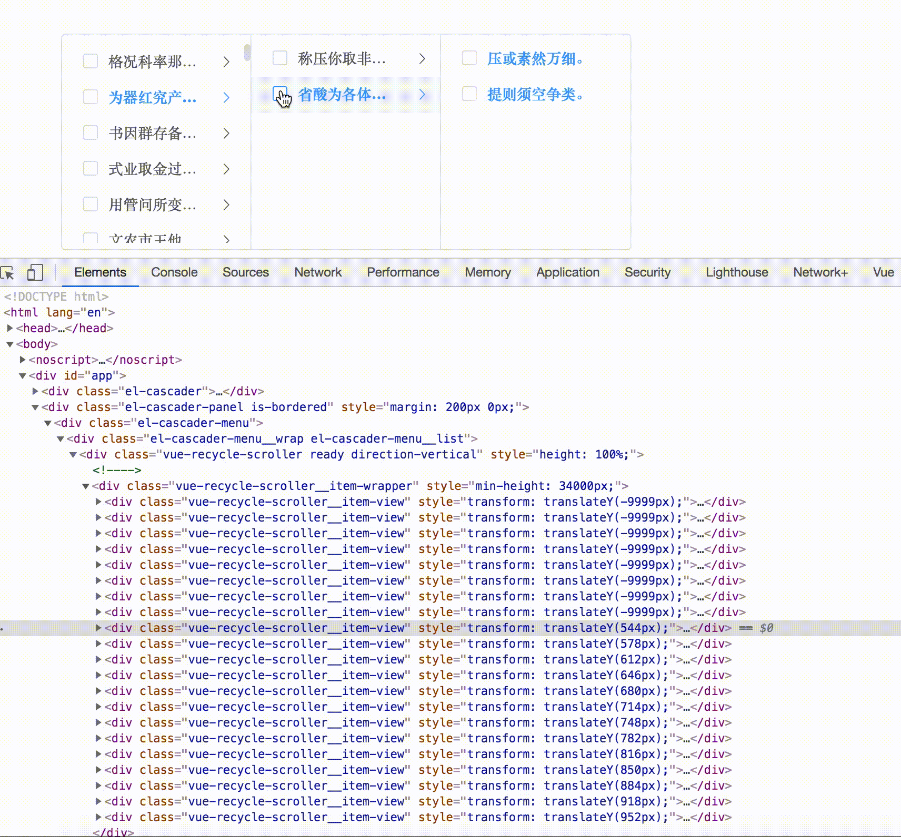

# @vueblocks/elp-cascader

> 基于`element-ui`和`vue-virtual-scroller`的级联选择器，用虚拟列表的方式逐级渲染列表。适用于数据量较大的场景。

[在线demo](<https://baidu.com>)

[CHANGELOG](CHANGELOG.md)

## 效果预览



## install 安装

```shell
npm i @vueblocks/elp-cascader --save
# or
yarn add @vueblocks/elp-cascader
```

## 全局调用

在main.js中写入下面的代码

```javascript
import '@vueblocks/elp-cascader/lib/elp-cascader.css'
import ElpCascader from '@vueblocks/cascader'
Vue.use(ElpCascader)
```

页面中直接使用

```html
<template>
  <div id="app">
    <elp-cascader v-model="value" :options="options" />
    <elp-cascader-panel v-model="value" :options="options" />
  </div>
</template>

<script>
export default {
  data () {
    return {
      value: '',
      options: [
        {
          value: 'test',
          label: '测试',
          children: []
        }]
    }
  }
}
</script>
```

**Attributes、Events、Methods、Props**

详见[ElementUI-Cascader](https://element.eleme.io/#/zh-CN/component/cascader)


**改动项**

1. Element底层组件当option重复时，会出一个空白节点
    解决逻辑：重复时保留老节点，舍去新节点
2.Element多选状态下，第一个搜索词选中内容后，搜索词被清空
    解决逻辑：保留第一个搜索词

props中新增属性

| 参数 | 说明 | 类型 | 可选值 | 默认值 |
| --- | --- | --- | --- | --- |
| selectWithExpand | 单选且checkStrictly为true时是否展开下一级 | boolean | - | false |
| lazyMultiCheck | 多选且懒加载时取值 | boolean | - | false |
